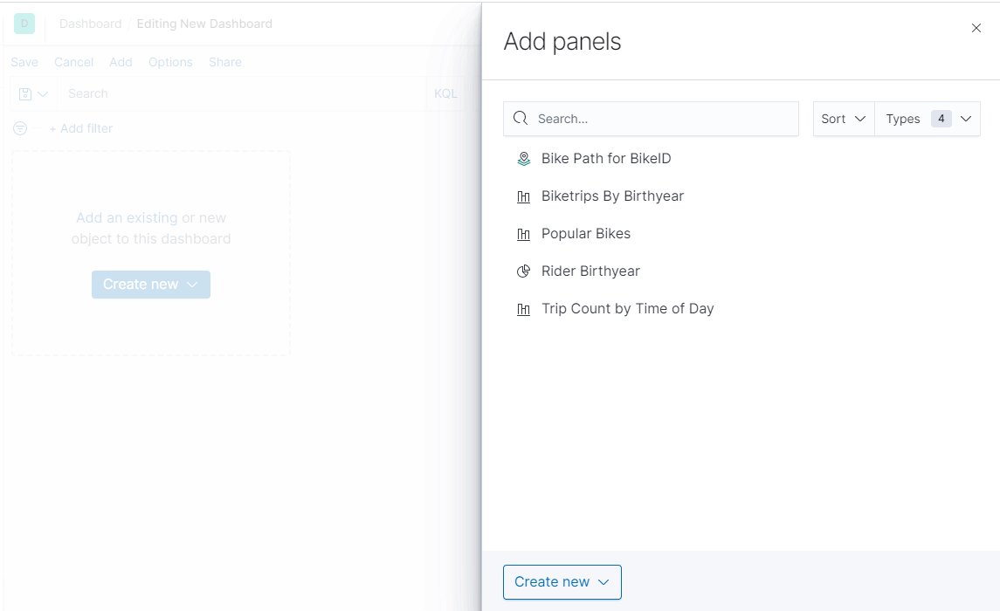
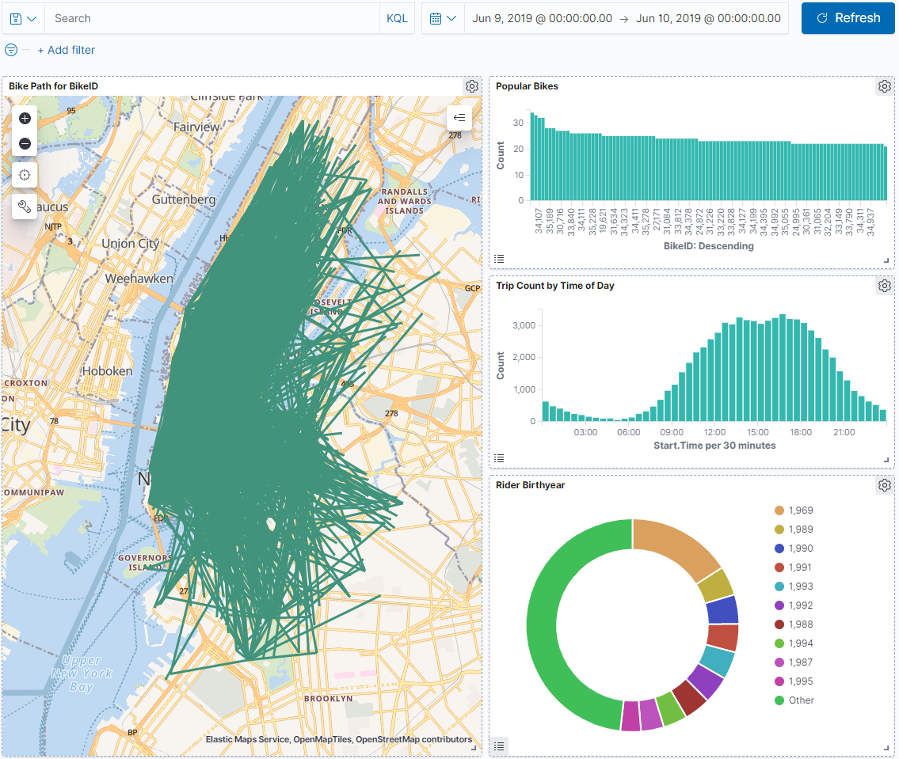
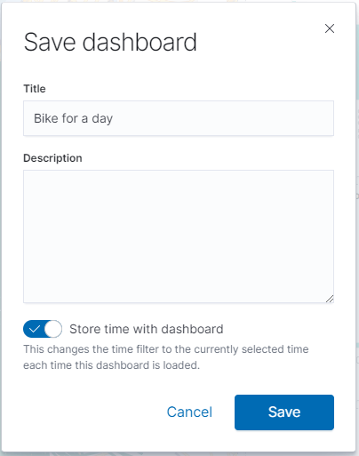
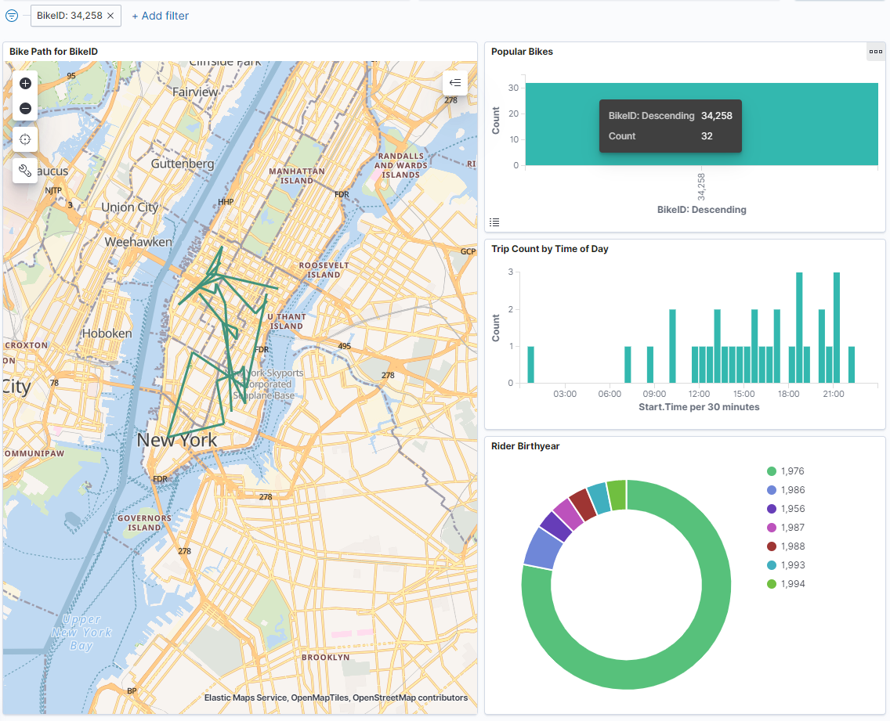
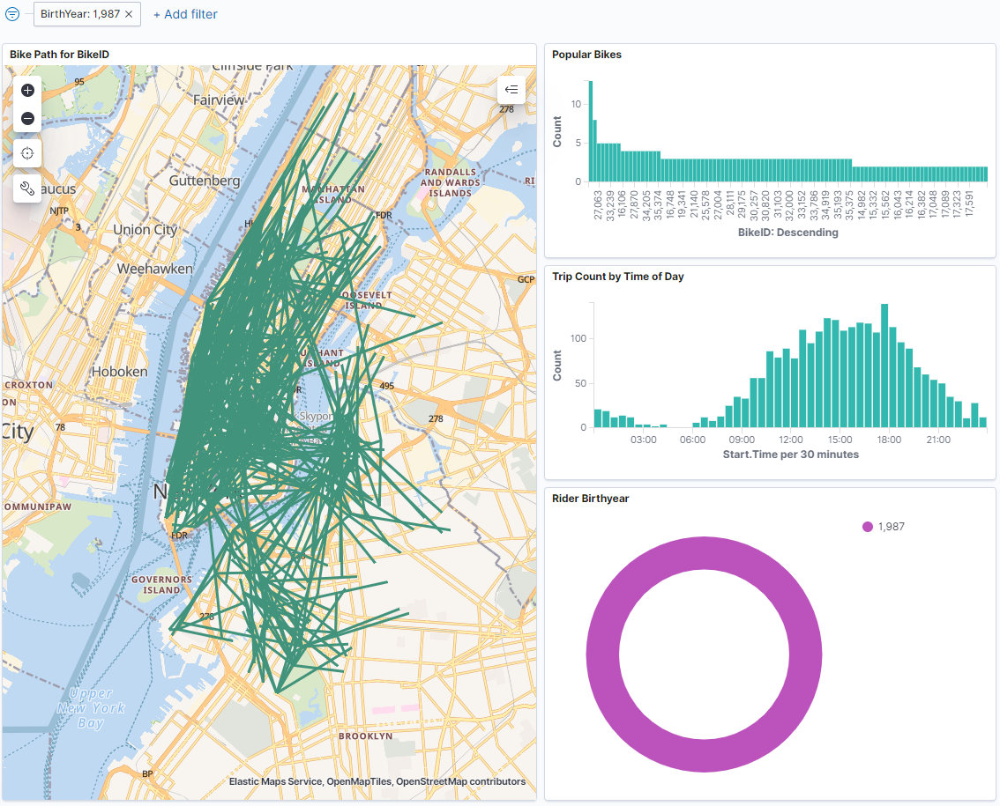

# Create a saved dashboard

Let's finish out this walkthrough with a dashboard.  If there's one thing that Elastic is famous for it's interactive, realtime dashboards, and while ours won't be realtime because we've preloaded the data, we'll make it interactive.  The realtime thing will have to come from you streaming your own data in through some pipeline you wrote, or maybe a kafka connector or something.  If you haven't seen it yet, this video is [one of the coolest uses of the realtime visualizations](https://www.youtube.com/watch?v=RKR4AmY7nTI).

Let's get started -- click on the "Dashboard" icon on the left, and click to "Create new Dashboard" to bring up the dashboard UI.  Clicking on the "Add" button up top will allow us to choose a saved object for the dashboard, and in this case I'm going to add "Bike Path for BikeID"

Go ahead and add "Popular Bikes", "Trip Count by Time of Day", and "Rider Birthyear" to the dashboard too, and arrange to your preference.  Mine looks like this now:

Let's save our dashboard now, before we start tinkering with it.  I'll give it the name "Bike for a day".  A note about the "Store time with dashboard" -- this is very useful when making a live dashboard, because the time details can be included.  It can store things such as "Last 15 Minutes" and an auto-refresh period of "Every Minute", so it makes the dashboard near-realtime when it updates.  It's always a good habit to store the time with the dashboard, too, if you are going to be dealing with a lot of records.  Kibana isn't going to render 80 million bike trips in one go, so restricting a dashboard on date and letting the user change it manually is helpful so that they don't lose confidence early.

Once we save, the dashboard should refresh with the layout parts disabled, you can click "Edit" to get those back.  Now, let's get to the interactive part.  On the "popular bikes" chart, click on one of the bikes that is up there.  I'm going to click on my old favorite "34258".  The map and the visualization panels should update to reflect the state of the new filter that was just selected.

There you go!  An interactive dashboard with Kibana!  There are a lot of clickable elements to add filters -- let's say we wanted to see all biketrips by people born in 1987 that day, we can simply click the "1987" in the pie chart and remove the filter for the BikeID:

I hope you enjoyed our tour of Kibana.  I think it's a great way just to get some data in Elastic and start understanding what it looks like.  I've used Kibana for all sorts of BI queries over the last couple of years, often taking SQL queries, pumping them through an [ndjson](https://www.elastic.co/guide/en/elasticsearch/reference/current/docs-bulk.html) transform and bulk loading them to Elastic just to see what the data looks like.  Feel free to use the RocDevESLoader project as a guide -- the first time I started bulk loading stuff into Elastic it took me a long time to figure out how to do it efficiently (hint: string templates for the json and the bulk index API), so if it helps move things forward for you, that's great!  If you have any questions or suggestions on this content please send me a email, PR, or PM.  Thanks for reading.

[Return to the beginning](./index).

