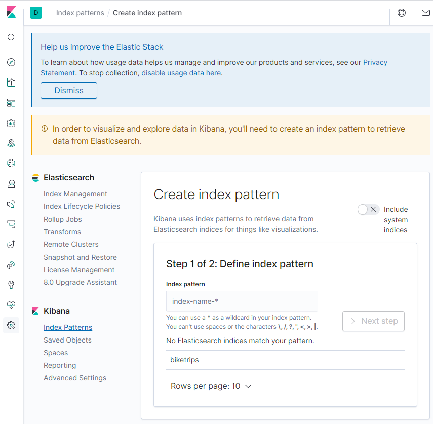
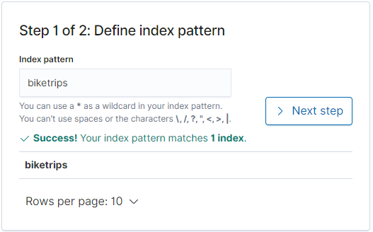
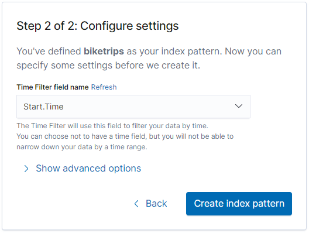
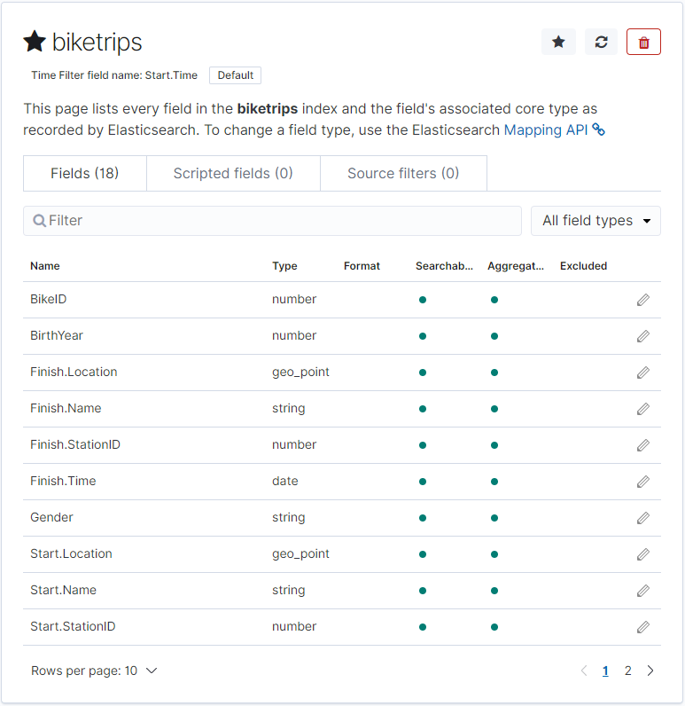
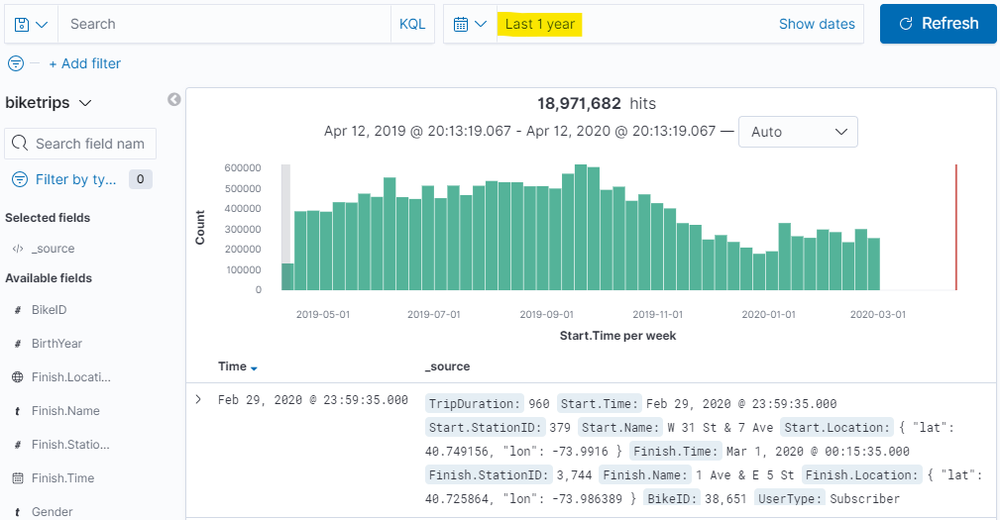
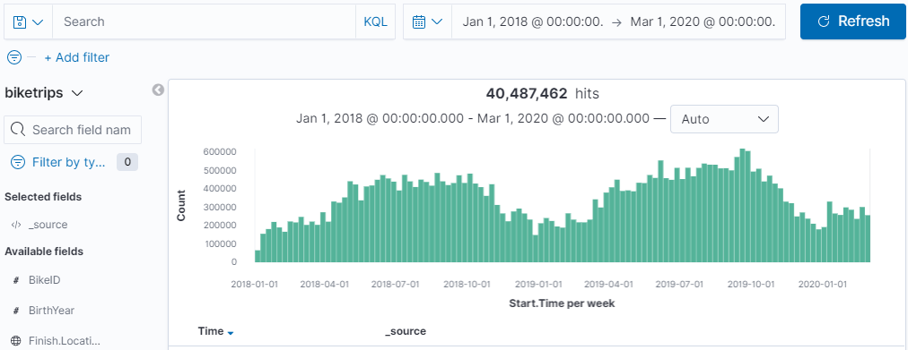

# Create and use a Kibana index pattern

If you've been following along with the walkthrough, we're at the point now where we have a 17gb Elastic cluster with data that we've formatted from CSV files.  Now, we're ready to load up Kibana for the first time and start looking at the most common interface for Elasticsearch.

The first thing we need to do is to go to the kibana URL.  For me, I installed this on the same machine that I used for Elasticsearch but on port 5601.  The first time Kibana is accessed it might take some time to load -- it has to create its own data storage index and documents inside the Elastic cluster to use (this is generally saved as the index .kibana).

Once the Kibana UI comes up, click on the "Discover" tab on the left hand nav panel.  There will be a screen that looks like this -- asking you to create what's called an "Index Pattern":

An index pattern tells Kibana how to translate the datatypes in an Elasticsearch index (or alias) into data that kibana can use for visualizations.  Generally both Elastic and Kibana do a good job of figuring out data types, but sometimes they'll need tweaking.  One neat thing about index patterns is that they can be [Index Aliases](https://www.elastic.co/guide/en/elasticsearch/reference/current/indices-add-alias.html) or [Wildcards](https://www.elastic.co/guide/en/kibana/current/tutorial-define-index.html).  This allows the use of partitioned indexes by time period (most commonly day) and group them together in an alias (the result is kind of like a union query against partitions).

For this walkthrough, we'll just use "biketrips" -- type "biketrips" into the index pattern field and click next.

Next it will ask to define a timeseries field.  This is helpful in interacting with Kibana so let's use Start.Time

Once you click "Create index pattern" it will take a few seconds to map to our index, and return with a list of fields and datatypes we can expect.

Now, clicking back on the Discover tab and changing our time range to "Last 1 year" will show us all of the records for the past year.

In fact, if you'd like to stretch Kibana's wings a little you can widen the time range -- here's everything for the previous 26 months:

The speed of Elasticsearch is incredible -- even on a single node.  It's aggregating across 40+ million records in a matter of seconds.  It's just counting records right?  And [select * from whatever] is pretty easy for any SQL database to do, so why bother?  But this -- this is an aggregation.  It's calculating which bucket along the date histogram each of those 40 million records fits into (remember, there's no concept of sequentially written data, we had to make a time series).  Now let's have a little fun exploring the data then and we'll move on to [Build and save some visualizations](./Visualizations).

