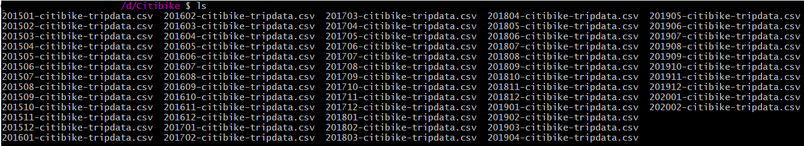
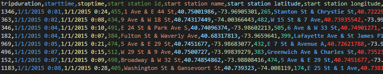
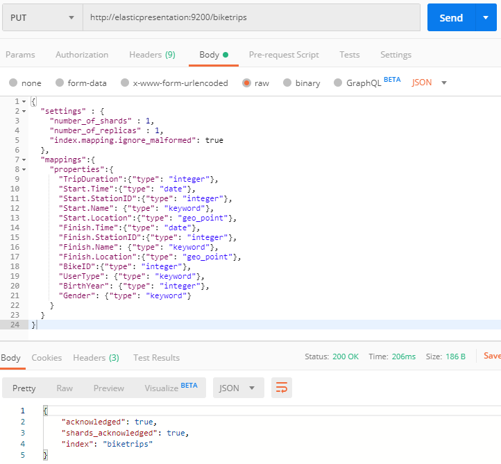
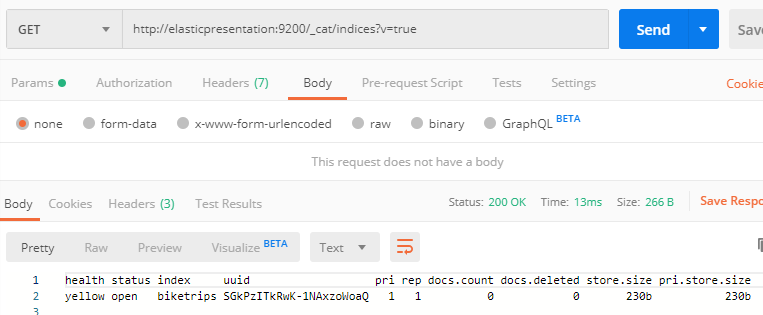

# Download public bike trip data and create an index mapping

The most important step in most data analysis projects is to have a general feel for the data you're working with.  Elastic happens to be *very, very good* at dealing with things and autodiscovery if you want to throw things at it, but for now we're going to choose to be a bit more organized.

The data we'll be using for this project is [Bike Share Data from NYC](https://www.citibikenyc.com/system-data).  You can read all about it on the linked page, but it's basically bicycle rental trip history with a very favorable usage license, which makes it perfect for us.  The data is linked to an S3 bucket [here](https://s3.amazonaws.com/tripdata/index.html).

Since it would be tedious to repeatedly click on things, let's download the files this way:

(2015-2016)

    for i in $(seq -f "%02g" 15 16); do for j in $(seq -f "%02g" 01 12); do curl -O https://s3.amazonaws.com/tripdata/20$i$j-citibike-tripdata.zip; unzip 20$i$j-citibike-tripdata.zip; done; done; rm *.zip

(2017-2020)

    for i in $(seq -f "%02g" 17 20); do for j in $(seq -f "%02g" 01 12); do curl -O https://s3.amazonaws.com/tripdata/20$i$j-citibike-tripdata.csv.zip; unzip 20$i$j-citibike-tripdata.csv.zip; done; done; rm *.zip

Once you have all the things downloaded, your directory should look something like this:

We have roughly 15GB of data downloaded, let's pop open a text editor and look at what's inside.  It looks as though the columns match up with the expectations of the "System Data" page on the website.  

Now that we have a basic view of the data we're importing -- we should create an [Index Mapping](https://www.elastic.co/guide/en/elasticsearch/reference/current/mapping.html) for it.  This simply tells Elastic how you plan to use the data you're sending, and sets up the index (with whatever settings you choose) in the process.  I have an index mapping pre-created for this exercise [as part of the RocDevESLoader project](https://github.com/jdyelle/RocDevESLoader/blob/master/RocDevESLoader/ES_mapping.json).

To apply this index mapping, all we have to do is to send it to our ES cluster with HTTP PUT using the name of the index you want (this will actually create an index for you):

Elasticsearch has confirmed the creation of our Index, but just to make sure let's check _cat/indices to be sure.

We can see from the screenshot that the "biketrips" index has been created, and that there are 0 documents in the index.  For those of you unfamiliar with ES terminology -- think of an "Index" like a table, a "mapping" like the DDL, and the "Document Count" like the number of rows.  This particular index is in "yellow" status instead of "green" because I'm running on a single-node cluster, and that makes Elasticsearch slightly uncomfortable because it's built to be resilient.

For now, we have a cursory understanding of what our data looks like (enough to write some DDL) and a directory full of CSV files.  We're ready to move on to the next phase -- [Download and run the RocDevESLoader tool](./RocDevESLoader).

