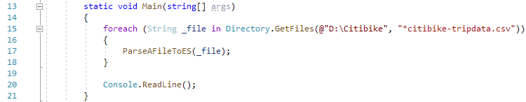
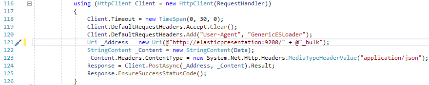
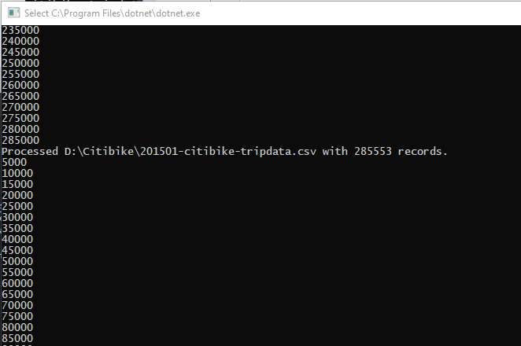
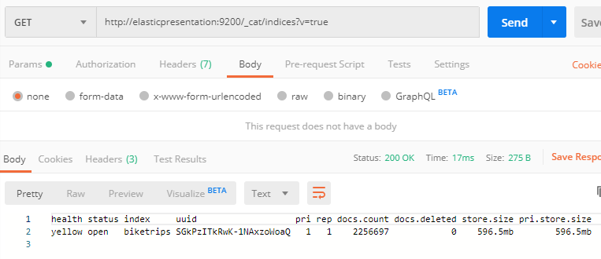
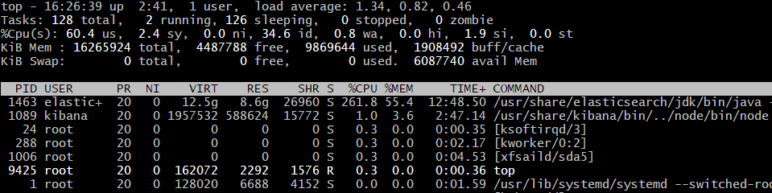
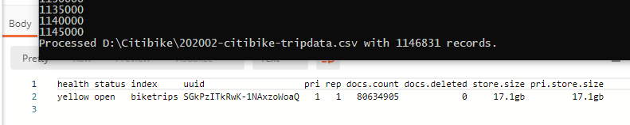

# Download and run the RocDevESLoader tool

Now that we have a directory full of files, we need a way to to load them into Elasticsearch.  There are a lot of tools out there for loading CSV files into Elastic, [FileBeat](https://www.elastic.co/beats/filebeat) and [LogStash](https://www.elastic.co/logstash) come to mind.  But rather than learning one of those, I've created a simple C# console app so that we can look at how the API for Elastic works instead.  I titled it RocDevESLoader and made it available at [https://github.com/jdyelle/RocDevESLoader/].  Clone this repository to wherever you'd like locally and let's tinker with it a bit in Visual Studio. 

In hindsight, it probably would have been a good idea to provide precompiled versions of this that would allow you to pass in the directory and the ES URL, but for now you're going to have to edit the code and compile it (sorry!).  I'll change that eventually.

The first thing to do is to make sure you set the input directory correctly:

Then change the URL of the _Address line to make sure it matches your environment.

If you hit "Run", it should start loading batches of 5000 records at a time into Elasticsearch.

Elasticsearch is very much on the AP side of the CAP theorem.  That means that even though you're ingesting documents, they may take a few seconds to actually be indexed, and may take a minute or two to show up in the index metadata.  After you see a few files go by, you should go back to your Postman window and verify the document count is increasing by using the _cat/indices endpoint again.  

Here's a view of what's going on with the Elastic node while this is happening.  Most of the CPU is going towards building Lucene's [Inverted Index](https://en.wikipedia.org/wiki/Inverted_index).

There's a fair amount of data here, so I'm going to let it run.  Last time I did a trial run of this it took about ~2 hours to load all of the data, and my ES VM is on the same LAN as my laptop.  It's probably faster if you load it locally (via localhost through Docker or a local VM) or slower if you're going over a WAN connection (to an EC2 instance or something).  Be patient, give it some time, or just load the 2019/2020 data and have it do less work.  I'll pause here and come back later.

A few hours later, I came back to the console letting me know that it had finished with the last file.  I checked /_cat/indices again and found 80 million documents!  Notice that the store.size is slightly larger than our original 15gb because of index space.

Now that we have all of our data loaded, let's continue to setting up Kibana -- [Create and use a Kibana index pattern](./IndexPattern).

