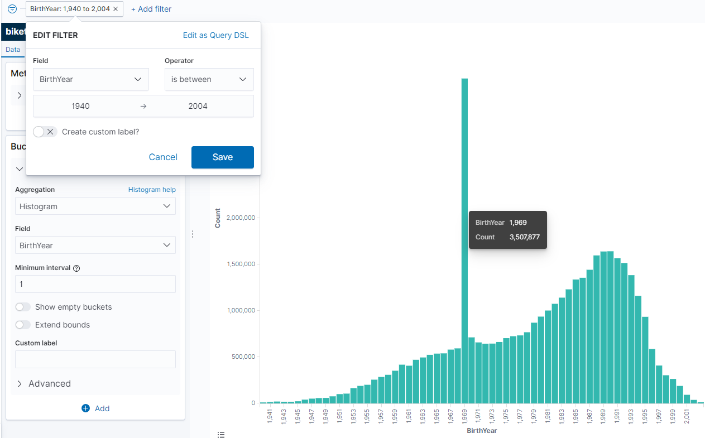

# Build and save some visualizations

Now it's time to finally have some fun with the data.  I'd like to thank you for making it to this part -- here's the part we've been trying to get to for the whole series.  If I've direct linked you to this page, on the previous pages we've identified our data (all ~80 million rows of it), created an index mapping, downloaded a CSV parser, uploaded our data, and told Kibana how to use it.  This page is going to get into building visualizations in Kibana using Elasticsearch.

Let's start with something simple -- a bar chart.  Open up your Kibana interface and the second button down on the left hand side should be "Visualize".  Let's chose a Vertical Bar.

Kibana will then ask you to choose a data source, and by that it means index pattern.  We only have one [biketrips] that we created earlier, so choose that one and it should take the whole document count and plop it on a chart for you.  That's our paint splotch on our canvas -- now it's time to do some painting.  You'll notice that it saved our timeseries from before, Jan 2018 to March 2020.  This is fine to start.  My count for this is just north of 40 million, so a good sample size.

If you look at the Axis options, you have the opportunity to "Add Buckets" under the X Axis.  To pick something easy, let's add a new X Axis with a Histogram for BirthYear -- Minimum interval 1.  I have also added a filter to limit the bounds of the chart to BirthYear between 1940 and 2004.

Interesting -- that's an odd looking anomaly.  It seems like 1969 is the most popular birth year *by far*.  I wonder why -- what if we were to add a bit more detail to our chart?  Let's add sub-buckets to the X axis -- we can have Kibana "Split Series" by UserType (with a Terms aggregation) and take a look at the results:

If we go back to [our original data spec](https://www.citibikenyc.com/system-data) it looks like there are two types of Users -- Customers and Subscribers.  Customers *overwhelmingly* report 1969 as their birth year (and a fair number of subscribers do too).  I wonder if this means there's an app default of 1969 and it's an optional field that a lot of people decide not to fill in?  That's just me guessing, but a lot of times outliers tell a story.

One of the great things about Kibana is that it tells you all of the underlying Elastic queries that it's using.  You can get some great statistics about the query that's running, the query itself (in case you were making your own UI in D3 or Vue or something) and the query response just by clicking on the "Inspect" button that's above the search bar:

 

It looks like the query that we're running against the Elastic cluster to generate this age/usertype breakdown across 40 million rows is only taking Elastic ~8s to execute!  Save your visualization as "Biketrips by Birthyear" or something similar so that you can find it later.  For now, we need to go build another chart to help us with the next step.

After you finish saving your chart, go back to the "Visualize" tab, and notice that your saved chart is there.  For this next one we'll need a new Vertical Bar chart.  

Pick a date -- in this case I'm going to pick a date in early summer when I think a lot of bikes will be active -- June 9-10, 2019, and set the date range to that.  It's a Sunday in NYC and it looks like there are almost 74,000 bike trips that day.  I'm going to build a vertical bar chart to tell me what the 100 most popular (by number of trips) bicycles were that day.

Using a Terms aggregation and sorting by Descending we can see along the X axis the popularity of the bikes -- and while I'm not picking the *most* popular one, Bike 34258 seems to be in the right place at the right time to get a decent ridership that day.  I'm going to save this one as "Popular Bikes" and move on.

Let's make some more visualizations so that we can tell the story of that bike on that particular day.  Here's one we'll call "Rider Birthyear" -- also if you use the "Inspect" tab, notice how *fast* Elastic is combing through these 80 million records to get stats on this one BikeID -- the query time to generate this graphic took 13ms.

Let's make another one for "Trip Count by Time of Day": 

So we have a few saved visualizations, and that's good.  We can build a dashboard from our saved Visualizations.  But I wanted to save the most fun visualization for last -- let's do a map.  We're going to plot where this bike went throughtout the course of the day and see what it looks like.  Click on the "Maps" button on the left, and notice that it reset our date range.  Thankfully if you select the dropdown with the stopwatch it should have saved it in our "Recently Used" list, so choose the day you selected previously.  

Click on "Add Layer" and "Point to Point" and choose "biketrips", "Start.Location", and "End.Location" in the dropdowns to set the map layer.  Once you have your data fields set, the map will be blurry from all the bikes used that day.

We're going to make this a little easier to read by changing some of the options for the map.  First, now that the "Add Filter" option is back, I'm going to put my selected bike back in -- the one I chose was 34258.  Then I'm going to click "Add Layer" and tinker with the colors a bit (at the bottom).  Notice that there are options to set a color or thickness by frequency, but for mine I just want a solid line with a fixed width.  

Here's what my map looks like after adding the bike filter, making the line changes, and changing the line labels to be the average TripDuration for a given segment.  Notice how when you hover over the segment it tells you how long that trip took.  It's not the *exact* path that the bike took -- we only have start point and end point, so that's all that's represented on the map, but if we had realtime data like strava or something, it would increase the resolution of our readings.

Here's a note about filters -- since a map can have multiple layers on it, if you were just going to make a map with a few bikes for the same date range you could add the BikeID in the "Filtering" section.  This would allow you to create multiple layers, each representing a different bike.  But -- for this map we want to use the global filter so that we can embed it and have it update with a dashboard.  That leads us conveniently into the next section -- but make sure we save our map first!  I'm going to save this one under "Bike Path for BikeID"

Let's head over to the next section so we can [Create a saved dashboard](./Dashboard).

