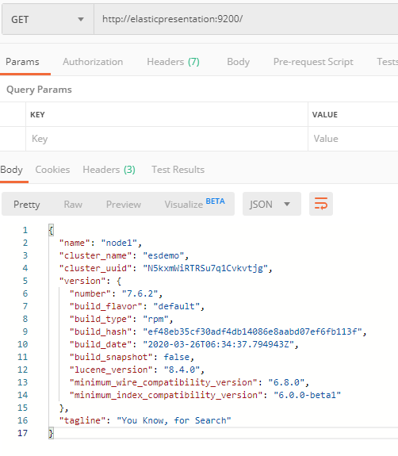

# Creating Kibana Visualizations with Bike Share Data

I've been working with Elastic for a few years now, and one of the most underappreciated features of Elastic is Kibana as a visualization tool.  Lots of people think of Elastic as a logging stack (probably because most of the focus has been ELK or Beats) and Log Data is a great use of Elastic, but Elastic is a really good tool for data discovery of any sort -- not just APM or Software logs.

In this walkthrough, we will:

* [Download public bike trip data and create an index mapping](./Mapping)
* [Download and run the RocDevESLoader tool](./RocDevESLoader)
* [Create and use a Kibana index pattern](./IndexPattern)
* [Build and save some visualizations](./Visualizations)
* [Create a saved dashboard](./Dashboard)

## Introduction

To follow along with this tutorial, you'll need a few things:
* A REST API tool such as [Postman](https://www.postman.com/)
* An Elastic cluster (or standalone server) running Elastic 7.6+ Basic (Not Apache2 or ODFE) with Kibana attached.
* The ability to build/run a C# application (You can use [Visual Studio Community Edition](https://visualstudio.microsoft.com/downloads/) if you'd like)
* I like to use [Git BASH on Windows](https://gitforwindows.org/)

If you use Postman to go to your Elastic URL, it should look something like this:

Just to give some hardware context, I'll be running this ES Cluster (and Kibana) as RPM packages on a VM that has:
* 4 CPU Cores (2.6GHz)
* 16GB of RAM
* 512GB SSD

This level of hardware isn't out of reach if you're just making a VM or running a docker from your laptop.

Once you're there, let's move on to [Downloading Citibike Data](./Mapping).

