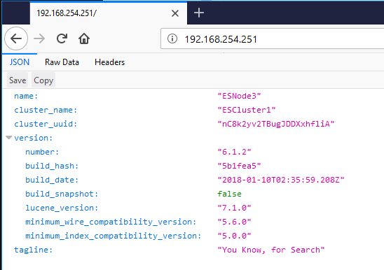
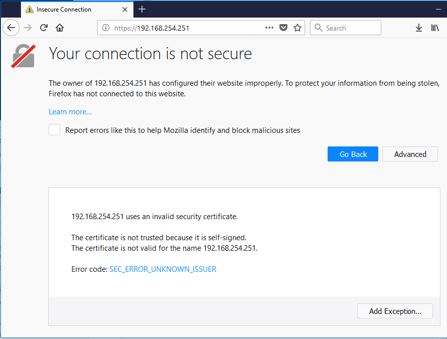
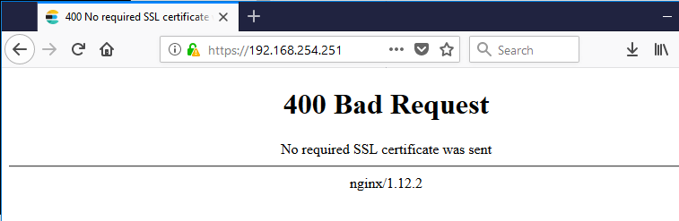
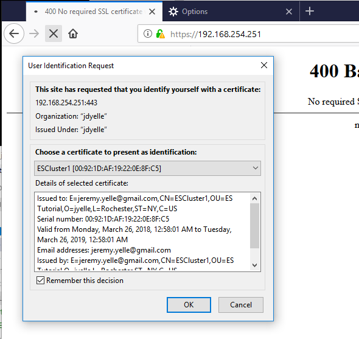
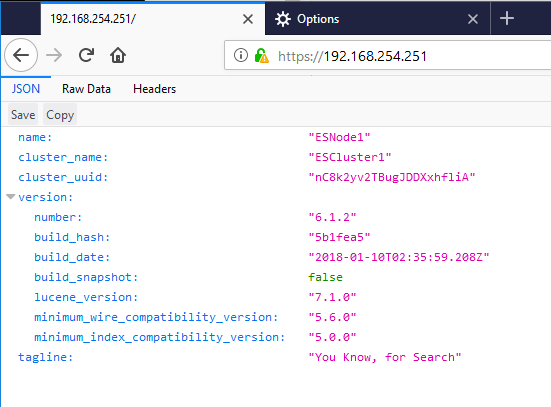

# Using Nginx with ElasticSearch

In this tutorial we'll talk about how useful Nginx is with ElasticSearch.  There's an excellent (although long) guide to using a few of the more advanced options of Nginx with Elastic on [Karel's post on Nginx tricks](https://www.elastic.co/blog/playing-http-tricks-nginx) but we aren't going to get into all of that -- let's just start simple.

There are a few ways we can use Nginx -- to enforce endpoint security (either authentication, authorization or encryption), to act as a load balancer, or if you just want a simple way to log requests that come into ElasticSearch.  Most people use Nginx in a combination of these ways.

## Restricting Access to Nodes with Nginx

First, let's talk about endpoint security.  Let's say that you're running ElasticSearch on a LAN where you don't want users to have unrestricted access to the HTTP API, but you have some legitimate apps running there so you can't just [turn off HTTP to that subnet](https://www.elastic.co/guide/en/elasticsearch/reference/current/modules-http.html).  One way that you could use Nginx to accomodate this with basic HTTP authentication is to bind ElasticSearch to the local loopback address and then set up Nginx as a proxy to access it, while enforcing logging and user authentication.

Remember in /etc/elasticsearch/elasticsearch.yml from our tutorial:

````
network.bind_host: ["192.168.253.251","192.168.254.251"]
````

We can change this to listen on the private network and the local loopback adress:

````
network.bind_host: ["192.168.253.251","127.0.0.1"]
````

Now that it is no longer listening on the public LAN, we'll put Nginx in to provide connectivity.  Nginx is part of the EPEL repository so we'll have to install the extra package repository:

````
[root@ESNode1 ~]# yum install epel-release
[root@ESNode1 ~]# yum install nginx
[root@ESNode1 ~]# vi /etc/nginx/nginx.conf
````

The default configuration (from the RPM) comes with a fair number of things configured in the config file out of the box.  We're going to leave most of it alone.  What we would like to do, though, is to add an `upstream` section to the config file that tells nginx where to find our ElasticSearch URL, and also add that to the `location` property in the `server` section.  So now, our nginx.conf should look like this (I'm cutting out the top/bottom sections for brevity, indicated by elipses):

````
...
    include /etc/nginx/conf.d/*.conf;

    upstream elasticsearch {
        server 127.0.0.1:9200;
        keepalive 15;
    }

    server {
        listen       80 default_server;
        listen       [::]:80 default_server;
        server_name  _;
        root         /usr/share/nginx/html;

        # Load configuration files for the default server block.
        include /etc/nginx/default.d/*.conf;

        location / {
                proxy_pass http://elasticsearch;
                proxy_http_version 1.1;
                proxy_set_header Connection "Keep-Alive";
                proxy_set_header Proxy-Connection "Keep-Alive";
        }
...
````

Save and quit your editor, and we have to make a few networking changes before nginx will work.  The first one is to add the http service to the firewall to allow external connections.  The second is to change SELinux to allow services to make http connections:

````
[root@ESNode1 ~]# firewall-cmd --permanent --zone=public --add-service=http
success
[root@ESNode1 ~]# firewall-cmd --reload
success
[root@ESNode1 ~]# setsebool -P httpd_can_network_connect on
[root@ESNode1 ~]# service nginx start
Redirecting to /bin/systemctl start nginx.service
````

Let's test this with a connection from our browser.  Notice there's no port number on the end of it so it's just using standard http ports and Nginx is proxying the request to the local Elastic service:


This means that we can use Nginx to manage connections to Elastic, and add authentication, encryption or authorization to our Elastic node.  I'll get into client certs a bit later in the tutorial but if basic http authentication is all you're looking for, you can set that up to use a .htpasswd file for node authentication.

## Using Nginx as an SSL Load Balancer

What if your Elastic nodes were on a segregated subnet or VLAN and you wanted to use Nginx as a gateway or load balancer for that subnet?  No problem!  Let's add the other hosts to the `upstream` section of the nginx.conf file:

````
[root@ESNode1 ~]# vi /etc/elasticsearch/elasticsearch.yml
[root@ESNode1 ~]# vi /etc/nginx/nginx.conf
````

We can change the `upstream` section of nginx.conf to look like this:

````
    upstream elasticsearch {
        server 192.168.253.251:9200;
        server 192.168.253.252:9200;
        server 192.168.253.253:9200;
        keepalive 15;
    }
````

Save and quit from your editor and reload Nginx:

````
[root@ESNode1 ~]# service nginx restart
Redirecting to /bin/systemctl restart nginx.service
````

Now, go back to your browser and refresh it a couple of times.  Notice how Nginx is round-robinning (Is that a word?  Did I just make that up?) requests through the nodes in the `upstream` property, with the node name changing every time:



If we take the public LAN network addresses out of `elasticsearch.yml` for all nodes, then ElasticSearch won't bind to those addresses, and connections via HTTP or Transport won't be accepted. That way, we've restricted traffic to the private network and can only access it through Nginx.

Ok now let's get fancy and add SSL to the mix. First, let's generate some ssl keys.  We're doing this in test.  Please promise me you won't use self-signed keys for the servers on your production cluster.  For the purposes of this tutorial, it will demonstrate our concept.

````
[root@ESNode1 ~]# openssl req -x509 -nodes -days 365 -newkey rsa:2048 -keyout nginx-selfsigned.key -out nginx-selfsigned.crt
     ... lots of questions ...
[root@ESNode1 ~]# openssl req -x509 -nodes -days 365 -key nginx-selfsigned.key -out client-selfsigned.crt
     ... the SAME questions ...
[root@ESNode1 ~]# openssl dhparam -out dhparam.pem 2048
[root@ESNode1 ~]# openssl pkcs12 -export -out client-selfsigned.pfx -inkey nginx-selfsigned.key -in client-selfsigned.crt
Enter Export Password:
Verifying - Enter Export Password:
[root@ESNode1 ~]# mkdir /etc/nginx/ssl
[root@ESNode1 ~]# cp nginx-selfsigned.* /etc/nginx/ssl
[root@ESNode1 ~]# cp client-selfsigned.crt /etc/nginx/ssl
[root@ESNode1 ~]# cp dhparam.pem /etc/nginx/ssl
````

Why didn't I use the same cert for the client cert as I did for the self-signed server cert?  I could have.  That would be *really* bad for security, because then whoever wanted to connect could just download the server cert and use it to connect back to the server as an authenticated person.  We're already breaking a lot of rules by using a self signed cert but that would just be ridiculous.

Let's edit our nginx.conf file to use the SSL certs we just generated.

````
    server {
        listen       80 default_server;
        listen       [::]:80 default_server;

        listen 443 ssl;
        ssl_certificate      /etc/nginx/ssl/nginx-selfsigned.crt;
        ssl_certificate_key  /etc/nginx/ssl/nginx-selfsigned.key;
        ssl_dhparam          /etc/nginx/ssl/dhparam.pem;
        ssl_client_certificate /etc/nginx/ssl/client-selfsigned.crt;
        ssl_verify_client optional;

        server_name  _;
        root         /usr/share/nginx/html;
````

Don't forget to add HTTPS to the list of things allowed through the firewall...

````
[root@ESNode1 ~]# firewall-cmd --permanent --zone=public --add-service=https
success
[root@ESNode1 ~]# firewall-cmd --reload
success
[root@ESNode1 ~]# service nginx restart
Redirecting to /bin/systemctl restart nginx.service
````

Let's try the HTTPS connection in the browser... and of course it's an unknown certificate error!


Which is great because it means everything is working properly.  If you add this exception it will look like the previous screenshots with the Elastic welcome page.

## Forcing Client Authentication with SSL Certificates

So we have SSL with Nginx working, but what about all of that client certificate business that we wanted?  Let's go back to the nginx.conf file and change `ssl_verify_client optional` to `ssl_verify_client on` and see what happens.



There we go.  Now it's rejecting our client because we don't have a client cert to send.  How do we install the client cert in our browser to continue to test?  We have to download that .pfx file that we generated (and provided a password for, so hopefully you remember that).  Each browser is different for installing a pfx file so I won't get into that here, but after you have the pfx file installed you should be able to make requests to nginx again:

Firefox offers the certificate to Nginx


Nginx responds with the page we're expecting


SSL client certificates are a great way to secure your ElasticSearch cluster and restrict connections to clients that you authorize.  Nginx adds some great logging, load balancing, and security options to Elasticsearch and there are a lot of other resources out there to help continue using some of the more advanced scenarios.  I'll put [Karel's post on Nginx tricks](https://www.elastic.co/blog/playing-http-tricks-nginx) here again just in case you missed it in the text above.

As always, thanks for reading.  If you'd like to see any edits or make comments please feel free to enter a GitHub issue or email me.