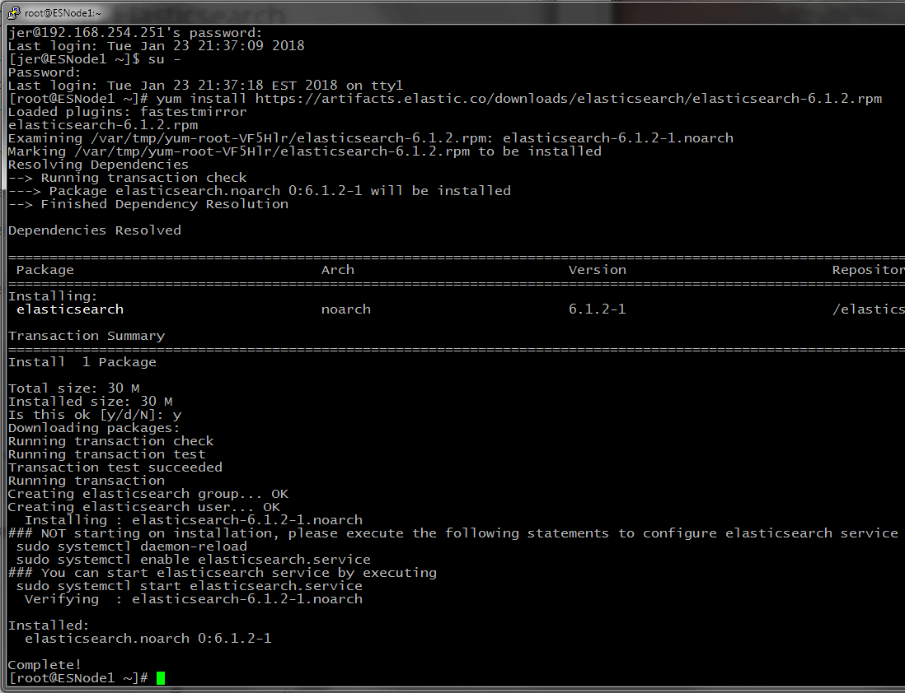
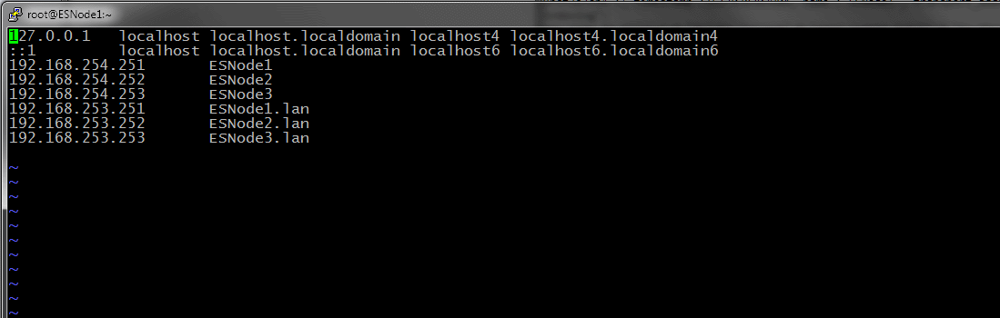
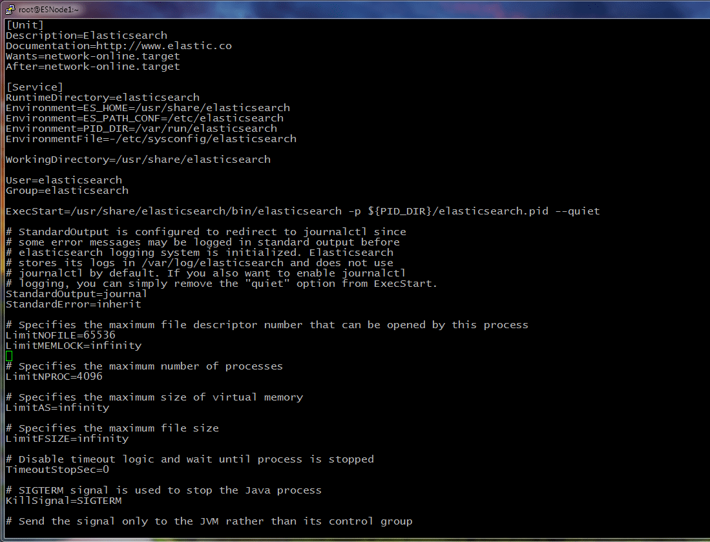

# Configuring Linux for ElasticSearch

Finally we are ready to install ElasticSearch on our Linux VM.  We have a few configuration changes to do on the operating system before installing Elastic so let's get started.

The first thing I'm going to do (since I'm not a fan of the NetworkManager platform) is uninstall it.  This is completely optional since generally NetworkManager won't get in the way, but I like manually managing my interfaces.


We have a few administrative commands to start with before we get to installing Elastic.  Let's start by updating the operating system packages to the most recent version.  This will take a few minutes to install:

````
yum update
yum install java-1.8.0-openjdk
````

If you want to verify the network startup and the disk partitioning, use the following commands to view your configuration.  This is less important on VMs but may be useful if you're setting up physical servers and you want to ensure consistency:

````
chkconfig --list network
fdisk -l
````

Now we are going to install ElasticSearch.  The easiest way to do this is to go to the  [Elastic Downloads](https://www.elastic.co/downloads/elasticsearch) page and get the RPM link.  You can right click and *Copy Link Address* to get the URL of the actual package.  Once you have this link, you can plug it into yum directly and yum will install it right from the internet.

````
yum install https://artifacts.elastic.co/downloads/elasticsearch/elasticsearch-6.1.2.rpm
````



So we have ElasticSearch installed, but haven't started it yet.  Before we start it up for the first time, let's change some configuration options and set up the rest of the networking and tell ElasticSearch to use the disk partitions that we've set aside for it.  Let's start by modifying the owner of the partition directory to the ElasticSearch user and changing the Linux Firewall to allow traffic on the standard ElasticSearch ports:

````
chown elasticsearch:elasticsearch /elasticsearch
firewall-cmd --permanent --add-port=9200/tcp
firewall-cmd --permanent --add-port=9300/tcp
````

Now we'll edit /etc/hosts and add the addresses (both public and private) for our VM cluster configuration.  In the screenshot below, I am using the .lan suffix for the private cluster addresses.  You will see why this is useful when we configure the elasticsearch.yml file later.


````
vi /etc/hosts
 192.168.254.251       ESNode1
 192.168.254.252       ESNode2
 192.168.254.253       ESNode3
 192.168.253.251       ESNode1.lan
 192.168.253.252       ESNode2.lan
 192.168.253.253       ESNode3.lan
````

Next up is to edit the service descriptor for ElasticSearch.  They've been really good about adding things to this file as the RPM gets built, so on newer versions of ElasticSearch these entries might already exist, but I'm going to put the important parts here anyway so that we can make sure to check them off the list as we go through the configuration.  Inside this file you should see these two items:

````
vi /usr/lib/systemd/system/elasticsearch.service
 LimitNOFILE=65536
 LimitMEMLOCK=infinity
````

In the screenshot I've provided, those lines are right above my cursor.



On to the ElasticSearch configuration files.  I'll give a brief rundown of each of the options here:

````
vi /etc/elasticsearch/elasticsearch.yml 
 cluster.name: ESCluster
 node.name: ESNode1
 network.bind_host: ["192.168.253.251","192.168.254.251","127.0.0.1"]
 network.publish_host: 192.168.253.251
 path.data: /elasticsearch/data
 path.logs: /elasticsearch/logs
 discovery.zen.ping.unicast.hosts: ["ESNode1.lan", "ESNode2.lan", "ESNode3.lan"]
 discovery.zen.minimum_master_nodes: 2
 gateway.recover_after_nodes: 2
````

* cluster.name -- This is the name for the cluster
* node.name --  This is the name you want to give the node to identify itself, keep it simple and use the hostname.  Your sysadmins will thank you later
* network.bind_host -- These are the network interfaces you want to listen for ES API connections on
* network.publish_host -- This is the network host that you want to pass cluster traffic on
* path.data -- The filesystem path for the node datafiles
* path.logs -- The filesystem path for the log datafiles
* discovery.zen.ping.unicast.hosts -- This is a list of hosts to check in with when starting up
* discovery.zen.minimum_master_nodes -- Configure number of nodes required for quorum
* gateway.recover_after_nodes -- Require this many nodes to start the cluster

````
vi /etc/elasticsearch/jvm.options
 -Xms4g
 -Xmx4g
 -Djava.io.tmpdir=/elasticsearch/temp
````

* -Xms4g -- Set the initial ElasticSearch memory pool to use 4GB.
* -Xmx4g -- Set the maximum ElasticSearch memory pool to use 4GB.  The optimal memory allocation for Elastic is roughly half of our total system memory, we need to leave space for Lucene and the Operating system
* -Djava.io.tmpdir -- Set the JVM's temp directory to use the partition that we set aside for ElasticSearch

With these options we have configured ElasticSearch to only start when two or more cluster nodes are available, listen on all interfaces, and send cluster communication to the private network.  We have also ensured that Data, Logs, and Temp are placed on the /elastic partition.

Since ElasticSearch is going to wait until two nodes are available to start the cluster, we have to bring up another node before we get any meaningful response from ElasticSearch.  We will use VirtualBox's Clone VM function to create ESNode2 and ESNode3 in the next section: [Cloning the Virtual Machine to Create More Nodes](./Cloning).