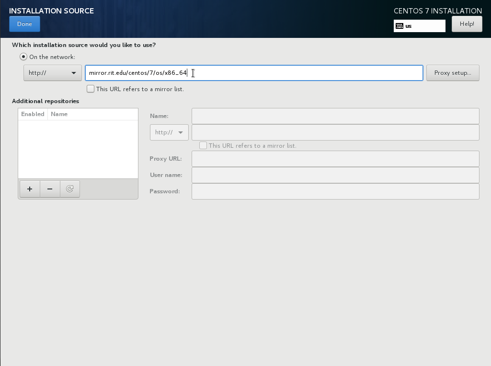
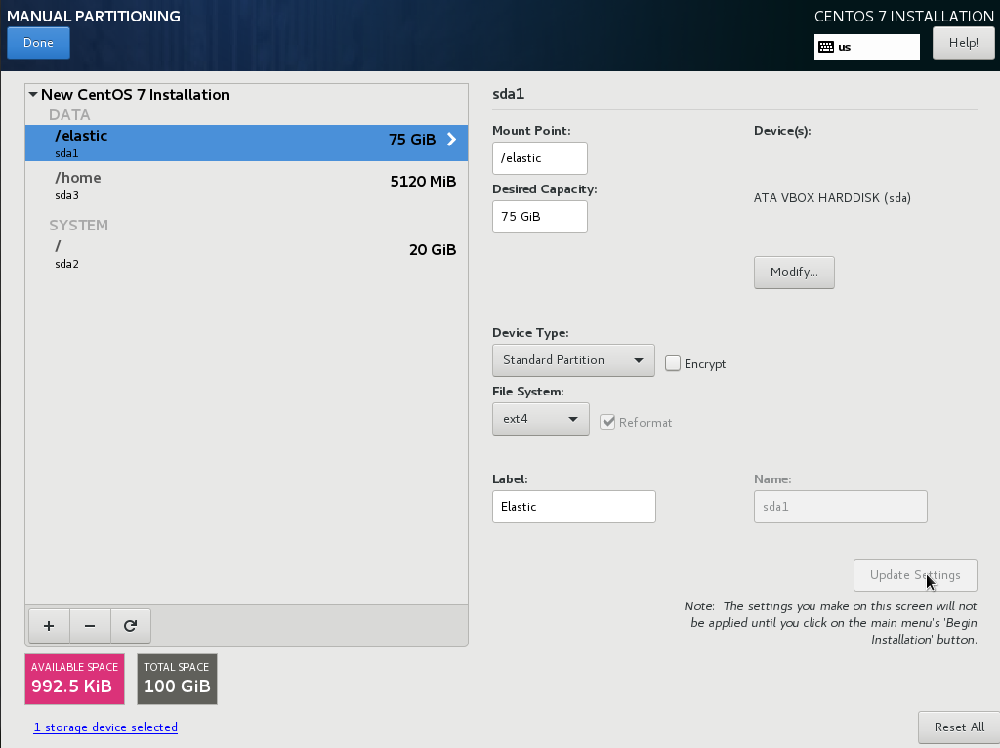

# Installing CentOS7 On VirtualBox

Now that we have our VirtualBox VM set up we're going to continue with Installing CentOS7.  If you completed the previous step you should have a VM ready to startup for the first time.  This part of the tutorial is intended for people who have no experience setting up Linux.  If you are an experienced CentOS user, you can jump down the page to the part of the tutorial where we work on the [filesystems and mount points](./OSInstall#FileSystem).

Let's click the _Start_ button on our VM to start the installer.

Clicking past the initial welcome screens leads us to this screen, where we configure various system wide options.  The first thing we need to do, since this is a network install, is to configure networking so that we can download the necessary packages to have a running system.  This is available on the lower left as _Network & Host Name_.  Click on that to jump to the network configuration screen.

## [Network Setup](#network)
Notice we have two network adapters showing on this page.  The first adapter will be the bridged adapter on the public LAN.  The second adapter will be the VirtualBox Host-Only Network adapter.  Let's configure each of these.

The first setting that is important to configure is the *Automatically connect to this network when it is available* checkbox.  This will allow the adapter to reconnect when the machine powers on.  I'm not sure why this isn't a default option in the Linux setup, there must be some history there, but I like to have my interfaces startup so that I can manage them through SSH rather than having to deal with a physical console.I would recommend enabling this option for both network adapters.

The next setting that we'll change is the IPv4 Settings tab.  We need to assign the IP Address that we're expecting for these hosts.  In the diagram I had set aside [192.168.254.0/24] for the public LAN so let's assign an IP Address that's in line with that.  In this case I'm using 192.168.254.251 for the first VM.  If you had a more elaborate network setup than mine you might have DHCP reservations and DNS set up, but for the purposes of my development sandbox I'm just going to use Static IPs and hardcode the addresses into the hosts file later.  Once we're satisfied with the adapter setup we can click *Save* and close out of the dialog.

After saving changes to our first network adapter setup, we can now click the *On* switch in the top right corner to enable the adapter.  You can see our changes reflected in the right hand panel with the updated IP Address and network information.  I also set the *Host name* to ESNode1.cluster on this screen.

Now we will turn our attention to the second network adapter, the private connection.  Again we check the box for *Automatically connect to this network when it is available* before moving to the IPv4 Settings section of the dialogue.

This time in the IPv4 Settings Dialogue we are setting the IP Address to our private network, 192.168.253.251.  I'm going to keep the last number consistent to make things easy to remember.  Make sure that the private network doesn't have a default gateway set up, that will force routing of internet traffic out through the public LAN.  Once we have set the IP Address for this adapter, we can save the changes and exit the dialog.

From our host machine, I will run a quick test of network connectivity.  I have my VirtualBox Host-Only Adapter set up on the [192.168.253.0/24] network and I can ping the private address of the VM.  The public IP of the VM is on the development subnet so I can just ping that through the bridged adapter.  Both connections are enabled and responding to traffic.

## [Installation Source and Software](#software)
Now that we have the VM networking configured properly (and presumably an internet connection), we will set up the installation source.  Since this is a net install image, getting the networking configured was a prerequisite for installing the OS.  For this next section we will click on the *Installation Source* link to open the source dialog.

This is how we tell CentOS where to find the OS packages to install from.  Since I'm in Rochester NY, I'm going to add a shameless plug for my favorite [CentOS Mirror](https://www.centos.org/download/mirrors/) at [Rochester Institute of Technology](http://mirrors.rit.edu/centos/).  Having the path correct is important - CentOS needs the base directory for the distribution and architecture that it is installing.  Once we finish entering a mirror and click *Done* in the top left corner, it should return to the main screen and list the mirror that we've selected as the installation source. 

The *Software Selection* link is right next to the *Installation Source* link, and once we have the sources set up we can click that to bring up this window.  For this installation of ElasticSearch we will only need the *Minimal Install*, selected on the left hand side.  You can always add more packages later, and we will add the specific extra packages we need for ElasticSearch after we have the initial OS install completed.  For now, *Minimal Install* is enough to get us started with a terminal window and the base environment.

## [Filesystem Setup](#filesystem)
Now we are ready to start the filesystem configuration.  This will be a little bit unconventional as Linux filesystem configurations go because the Elastic documentation specifically asks to disable swap space on a host.  We start by clicking the *Installation Destination* link.

This brings up a pane that allows is to select which disk to install CentOS to - we see the virtual disk we created in [Creating The First VM With VirtualBox](./VMConfig).  Click the *I will configure partitioning* button below and then click on the *VBox HardDisk* link.

I'm a fan of round numbers, so let's create our first partition as 20GiB and make that the root partition.  This will hold our system files, boot environment, and everything that the system needs to run.

The CentOS installer seems to encourage xfs, which is a great filesystem if you have *massive* partitions, but since I'm more familiar with ext2/3/4 I'm going to go with that for this demo.  XFS is probably a better choice if you're running large amounts of data and there's no chance you'll have to recover from a power outage (if you're running this in a datacenter or cloud environment).  Feel free to label the partitions if you'd like.

For our 100GB Disk, create the following partitions:
- /elastic - 75 GiB ext4
- /home - 5120 MiB ext4
- /root - 20 GiB ext4

This will enable us to segregate the operating system and binaries, the user partition, and the ElasticSearch data and logs.  If we have larger disks than 100GB, we could add all of the extra space to the /elastic partition, assuming the server was only going to be used as a node for our cluster.

Notice that we have not included a swap partition.  Clicking the yellow warning on the bottom of the screen alerts us to the fact that CentOS is questioning our judgement.  Normally, for a fileserver, a webserver, or email server we'd want to have swap space enabled.  In this case we have a database server, and we can use Elastic to manage the memory use.  If our database memory gets swapped out to disk, it can make things really slow.

After clicking *Done*, and clicking *Done* again (because of the warning), we get a summary of the changes that CentOS is making to the disk.  You can compare the changes of your installation to the changes on this screenshot to verify your partition configuration.

## [Finishing the Installation](#finish)
Once we have finished clicking through all of the configuration options and wizards, we have no more warnings on the summary screen and can continue with our installation.  Click the *Begin Installation* button when you are ready for CentOS to start downloading and installing packages.

While the installer is running, CentOS allows us to set a root password and create an unprivileged user to log in with.  In this case I allowed my user to have sudo access.

Once the installation is complete click *Reboot* to restart the VM and boot into Linux.

Here is a screenshot of the VirtualBox Manager with the VM running.  You can see the stats of the machine in the background while the machine is waiting at the login prompt.

Now that we have the operating system installed and networking is connected, I'm going to switch to an SSH terminal for the next section [Configuring Linux for ElasticSearch](./ElasticSearch).  Working in the VirtualBox console is less convenient.