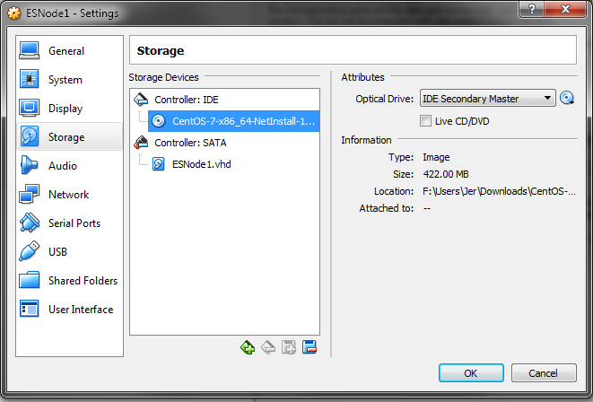

# Creating The First VM With VirtualBox

I am running VirtualBox on my Windows 7 workstation in this example, but one of the advantages of VirtualBox is that it's cross platform, so it should look similar no matter which host operating system we use.

For this section, please download a copy of [CentOS 7 Network Install Image](http://isoredirect.centos.org/centos/7/isos/x86_64/CentOS-7-x86_64-Minimal-1708.iso) and have it available to link to the VM.

We are going to target the following specs for the guest OSes:
* 2 CPU Cores Each
* 8GB of Memory
* 100GB Storage
* Public Network Connection
* Private Network Connection

Let's start with Configuring the VM Name, OS, and Memory:

For the disk creation, I chose VHD disk image in case I wanted to use this with Hyper-V later, but any of the choices in bold will work nicely for our example.  Here I am creating a 100GB dynamically allocated disk.  If you're expecting to do performance testing with this cluster, I would recommend switching to "fixed size" instead so that the host OS doesn't need to allocate more file space while the cluster is trying to write documents into the guest.

Once we have the VM configuration created, we're going to change a few things to change for the guest OS installation.  On the _System_ tab set the number of CPUs, the CPU acceleration options and make sure the VM has an adequate amount of memory.  On the _Storage_ tab, add a connection to a CentOS 7 Net Install ISO that we've downloaded.  

After attaching the CentOS ISO to the VM, let's set up our network adapters.  The first adapter we will bridge to the ethernet adapter of the host machine.  This allows it to participate on the network with the rest of the hosts.  I have a development network setup on 192.168.254.0/24 for my development projects so I'm going to use that for this adapter.

The next adapter we will set up on the VirtualBox Host-Only network.  We will use this network for the cluster communication for ElasticSearch to keep the nodes in sync.  I changed my VirtualBox Host-Only IP network in the VirtualBox settings and on my host machine to a different subnet than the one originally assigned by the VirtualBox installer.  My VirtualBox Host-Only network runs as [192.168.253.0/24] so if yours is a different IP range (I think the default is 192.168.56.0) then you may need to change which IPs you use for the private network in the rest of the tutorial.  It doesn't matter what you use for that subnet, but it does have to be consistent across the nodes/host/VirtualBox settings.

Now that we have the VirtualBox components set up we can move on to [Installing CentOS7 On VirtualBox](./OSInstall).
