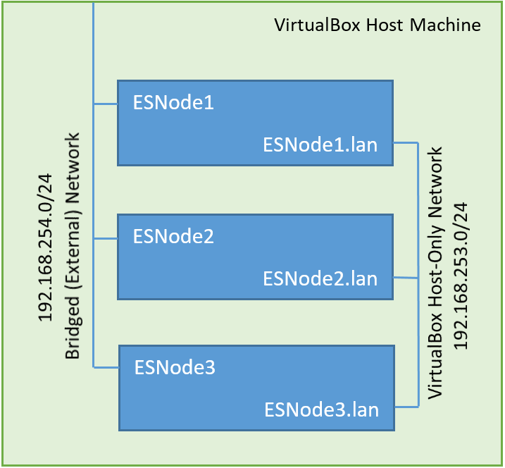

# Creating a Simple ElasticSearch Cluster with VirtualBox

This tutorial will demonstrate the basics of building an ElasticSearch Cluster by using VirtualBox VMs.  I'll break this tutorial into a few parts so that it's easier to take on one piece at a time.  As an alternative, you could deploy multiple docker containers with ElasticSearch on the same host, but this will be closer to the settup of physical hosts and translates easily to physical servers.

* [Creating The First VM With VirtualBox](./VMConfig)
* [Installing CentOS7 On VirtualBox](./OSInstall)
* [Configuring Linux for ElasticSearch](./ElasticSearch)
* [Cloning the Virtual Machine to Create More Nodes](./Cloning)

## Introduction

In this example we will use a private network and a public network.  In production environments it is best practice to use a private cluster network for communication between nodes, and use the public network for accessing the cluster.  This ensures less network congestion for cluster traffic and will also keep the chattiness to a minimum on networks with non-cluster hosts.

For our example, we are not going to use TLS since this is intended to be a walkthrough for developers to get a basic idea of how a cluster works.  If you would like to install TLS on your ElasticSearch cluster, there is a great blog post on it [here](https://www.elastic.co/blog/tls-elastic-stack-elasticsearch-kibana-logstash-filebeat).

## Simple Network Diagram

When we are finished with the tutorial, we should have a functional ElasticSearch cluster of three virtual nodes, each with an IP address on the public subnet [192.168.254.0/24], and an IP address on the private VirtualBox only network [192.168.253.0/24] .  I will demonstrate how to ensure that cluster communication happens on the private network and that the cluster is accessible for development.

The Elastic cluster will be accessible by sending a request to to any of the nodes on their public IP Addresses.

Let's move on to [Creating our first VM](./VMConfig).

